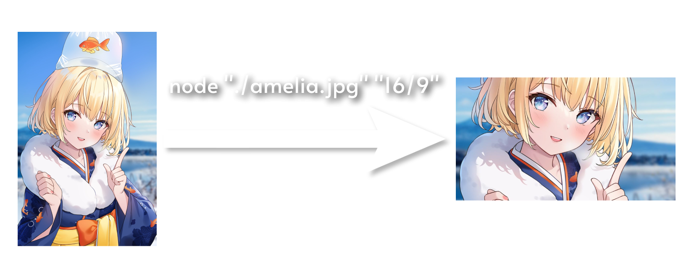
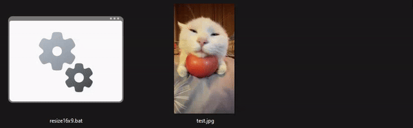

<h1 align="center">🖼️ Resize Image By Ratio </h1>
<p align="center">

</p>

## Description

Very simply JS script to resize image by ratio.

## Requirements

If you want to try app by yourself, you will need:

- Node.js v18.17.0 or higher

## Installation

1. Clone this repository: `git clone https://github.com/richardscull/ResizeImageByRatio`
2. Go to the folder: `cd ResizeImageByRatio`
3. Install dependencies: `npm install`

## Usage

### Using .bat files (Windows only)

Use any image of your choice on any of .bat files, it will resize image by ratio and save it to the same folder as script.



You also can create copy of any .bat file and change ratio in it.

Example:

```bat
:: Change ratio from 4x3 to 16x9
node src/index.js %1 4/3 --> node src/index.js %1 16/9 
```

### Using CLI

1. Go to the folder: `cd ResizeImageByRatio`
2. Run script: `node src/index.js <path to image> <ratio>`. `<ratio>` is optional, default is 16/9
3. Example: `node src/index.js ./example.png 4/3`
